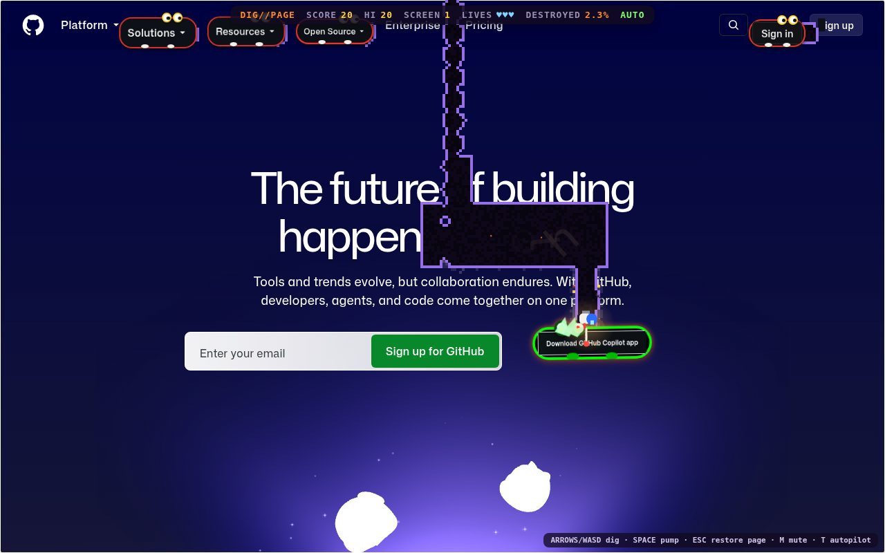

# DIG//PAGE

**Play:** https://drunknbass.github.io/misc/digpage/

DIG//PAGE turns the web page you're looking at into a Dig Dug-style level.

- **The page's text and images are the dirt.** Letters you tunnel through fall, bounce and burn to ash.
- **The page's own buttons, links, inputs and icons are the enemies.** They peel off the page, grow goggle eyes, and chase you through your tunnels. Pump one four times and it inflates until it pops into confetti in its own colors.
- **Big images and boxes are rocks.** Dig under one and it falls, crushes whatever is below, and shatters into pieces of itself.
- **Esc puts the page back exactly as it was.**

## Install

| Method | How |
|---|---|
| Bookmarklet | Drag the button on the [install page](https://drunknbass.github.io/misc/digpage/) to your bookmarks bar, open any page, click it. |
| Userscript | With Tampermonkey or Violentmonkey, open [`digpage.user.js`](https://drunknbass.github.io/misc/digpage/digpage.user.js) to install, then press **Alt+Shift+D** on any page. |
| Console | Paste the contents of [`digpage.min.js`](digpage.min.js) into your browser's DevTools console. |

## Controls

| Key | Action |
|---|---|
| Arrows / WASD | Dig and move |
| Space | Pump (4 pumps pop an element; if you stop, it deflates) |
| Esc | Quit and restore the page |
| T | Autopilot |
| P / M / Enter | Pause / mute / play again |

Scoring: buttons are worth more than links. Deeper enemies score up to ×2.5. A winged enemy popped from the side scores double, and a rock that crushes enemies earns a bonus. The HUD shows score, lives, and how much of the page you've destroyed. Clear every enemy and the page scrolls to the next screen.

## How it works

1. **Page → grid.** The visible viewport is rasterized into a grid of 4 px cells, colored from each element's computed background, borders and images. Every visible letter becomes its own object: text nodes are walked with a `Range` per character.
2. **Digging.** Tunnels are carved with sine-wobbled edges, a dithered scorch ring, an indigo void and glowing ember rims. Letters the tunnel touches detach and fall.
3. **Elements → enemies.** Interactive elements are chosen by type (button > input > icon > image > link). Each one is copied into an inert snapshot: plain elements with computed styles applied, so no page code runs. The original is hidden while its snapshot plays the enemy. Pumping scales and squashes the snapshot, and popping it scatters the element's own colors and letters.
4. **Rocks.** Large images and visually distinct boxes become rocks that fall once nothing is underneath them.
5. **Overlay.** Everything is drawn in a single fixed overlay (shadow DOM, placed in the browser's top layer so it stays above cookie banners and dialogs). Page elements are only hidden temporarily. Each inline style that was touched is saved and restored on exit.

## Privacy & safety

- A single self-contained script with no dependencies. It makes **no network requests** of its own and loads nothing remote. Images already on the page are redrawn from memory.
- It stores nothing (no cookies or localStorage), collects nothing, and never evaluates page content or runs page scripts.
- It never uses `eval`, `innerHTML` or `<style>` tags. Styling goes through the CSSOM, which keeps it compatible with Trusted Types and strict style policies.
- Keyboard input and scrolling are captured only while the game is running. Esc (or running it again) removes the overlay and restores the page.

## Sites that block bookmarklets

Sites with a strict Content Security Policy, such as github.com and MDN, can stop bookmarklets from running: clicking the bookmark does nothing. The userscript and the console method still work there. Browser-internal pages (settings, extension stores, PDF viewer) never run bookmarklets.

## Known limitations

- Content inside cross-origin iframes (ads, embeds) and inside web-component shadow roots is treated as a plain box.
- A letter on top of a background image leaves a letter-shaped hole rather than revealing the true background.
- Keyboard only; no touch controls yet. Page scrolling is paused while you play.
- Overlays that a page opens after the game starts may appear above it.

## Credits

Inspired by Hugo Duprez's [destroy.spritefusion.com](https://destroy.spritefusion.com) ([post](https://x.com/hugoduprez/status/2104579137575018827)), which turns a web page into a destructible level. DIG//PAGE brings that idea to a Dig Dug-style game. Code, art and sound are original; DIG//PAGE is not affiliated with Dig Dug or its owners.

MIT License.
